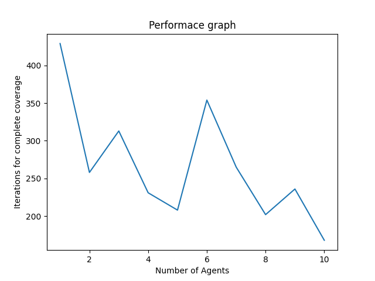

# Frontier Based Coverage Using Multiple Agents

## Introduction
Robots have become increasingly important in many aspects of life, from manufacturing to health care, logistics to entertainment. The basic building blocks for the robot or agent to function in an environment are Perception, Navigation and Control. To navigate in an environment, it is necessary for the robot to require a map in which they operate. This project proposes an implementation of a novel swarm-based algorithm for the exploration and coverage of unknown environments while maintaining the formation of the swarm and a frontier-based search for effective exploration of the unknown environment. <br>
This project is inspired from the paper by <br>
``` V. P. Tran, M. A. Garratt, K. Kasmarik, and S. G. Anavatti, “Robust Multi-Robot Coverage of Unknown Environments using a Distributed Robot Swarm,” CoRR, vol. abs/2111.14295, 2021, [Online]. Available: https://arxiv.org/abs/2111.14295 ```

## Pipeline
<p align="center">
    
</p>

## Instructions to run the code
- Clone the repository <br>
```git clone https://github.com/okritvik/Frontier-based-coverage-using-multiple-agents.git```
- Open the cloned repository and open terminal
- Make sure the current directory is ```Frontier-based-coverage-using-multiple-agents```
- Change the directory to Codes folder using the command<br>
```cd Codes/```
- Run the python code using <br>
```python3 map_coverage.py``` <br> or <br> ```python map_coverage.py```
- The program will ask for user inputs

### Example user inputs
- Please input the length/breadth of the occupancy grid: ```25```
- Enter number of agents: ```3```
- Enter the number of obstacles in the occupancy grid: ```10```
- Now the program will show the picture of random obstacles in the map (for user's understanding) and the agents will start exploring until they cover whole map.

## Results
Agent 1                    |  Agent 2
:-------------------------:|:-------------------------:
  |  

Agent 3                     | Agent 4
:--------------------------:|:-------------------------:
    |   

Initial Map                    | Final map
:--------------------------:|:-------------------------:
   |  

## Performance Metrics
Map                    | Performance
:--------------------------:|:-------------------------:
    |   
:--------------------------:|:-------------------------:
    |  

## Report
The Project Report can be read found 